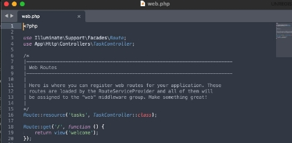
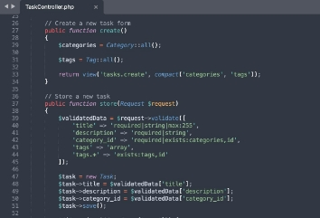

**Sarcina nr.1. Pregătirea lucrării**

M-am asigurat că fisierul **.env** este configurat corect pentru a permite conectarea aplicatiei Laravel la baza de date.

**Sarcina nr.2. Crearea formularului**

Am adaugat un formular create.blade.php pentru adaugarea sarcinilor titlului ,descrierea, data limita, categorie

Formularul trimite date prin metoda **POST** catre o ruta care sa proceseze aceste date si sa salveze in bazele de date

resources/views/tasks/create.blade.php:

Am creat ruta **POST**

Am actulizat TaskController cu

**create()** care va returna formularul de creare a unei sarcini, încărcând categoriile din baza de date

**store()** care va valida și salva datele primite de la formular

**Sarcina nr.3. Validarea datelor pe partea de server**

Am implementat validarea datelor direct in metoda **store()** a controlerului TaskController

Folosim metoda **validate()** din Laravel pentru a valida datele primite de la utilizator.

Am implementat cerintele de validare pentru campurile formularului si gestionarea erorilor de validare.

4. **Crearea unei clase de cerere personalizată (Request)**

Am creat CreateTaskRequest

Aici am definit regulile de validare similare celor din controller

Metoda **rules** definește regulile de validare pentru câmpurile formularului, exact așa cum erau definite în controller.

Metoda **messages** permite definirea mesajelor personalizate de eroare, pentru o mai bună claritate la utilizator.

Am actulizat metoda **store** in TaskController pentru a folosi CreateTaskRequest în loc de Request.

5. **Utilizarea șabloanelor Blade**

In metoda **store** am adaugat un mesaj flash folosind funcția session()->flash(). Mesajul va fi disponibil doar pentru urmatoarea cerere si va putea fi afisat in view-ul respectiv.

Am actulizat metoda **store** pentru a adauga un mesaj flash la salvarea cu succes a sarcinii

**{{ session('success') }}**: se afiseaza mesajul flash de succes.

6. **Protecția împotriva CSRF**

Am folosit directiva **@csrf** pentru protecția împotriva atacurilor CSRF. Si fromularul este trimis doar prin metoda POST

7. **Actualizarea sarcinii**

Am creat o clasa UpdateTaskRequest pentru validarea datelor formularului

In routes/web.php am adaugate rutele necesare Am adaugat metoda edit in TaskController

Metoda edit va incarca formularul de editare a sarcinii si va trimite datele necesare în viziune.

Am actulizat metoda **update** in TaskController pentru a procesa datele din formular

In fisierul resources/views/tasks/edit.blade.php, am creat un formular care va permite utilizatorului sa editeze sarcina.

**Intrebari de control**

**1.**Ce este validarea datelor și de ce este necesară ?

Validarea datelor este procesul de verificare a corectitudinii si integritatii datelor primite de la utilizator inainte de a le stoca sau utiliza in aplicatie. Este necesara pentru a preveni erorile, a proteja aplicatia impotriva atacurilor (de exemplu, injectii SQL) si a asigura ca datele respecta cerintele specificate (ex. tip de data, lungime, format).

**2.**Cum se asigură protecția formularului împotriva atacurilor CSRF în Laravel ?

Protecția formularului impotriva atacurilor CSRF in Laravel se face prin adaugarea unui token unic in fiecare formular. Acest token se adauga automat folosind directiva @csrf in formular. Laravel verifica acest token la trimiterea formularului, iar daca tokenul nu corespunde, cererea este respinsa, prevenind atacurile CSRF.

**3.**Cum se creează și utilizează clasele personalizate de cerere (Request) în Laravel?

In Laravel clasele personalizate de cerere (Request) se creeaza folosind comanda php artisan make:request NumeRequest. Aceste clase contin reguli de validare si mesaje de eroare personalizate.

Pentru a le utiliza, le importi in controller si le folosesti ca tip de parametru in metodele care proceseaza cererile, in loc de Request standard. Laravel va valida automat datele cererii folosind regulile definite in clasa Request si va returna erorile daca este cazul.

Exemplu:

1. Crearea clasei: php artisan make:request StoreTaskRequest
1. In controller: public function store(StoreTaskRequest $request)

**4.**Cum se protejează datele împotriva atacurilor XSS la afișarea în vizualizare?

Pentru a proteja datele impotriva atacurilor XSS (Cross-Site Scripting) in Laravel, trebuie sa folosesti functia {{ }}pentru a afisa variabilele in vizualizare. Aceasta sintaxa escapeaza automat orice caracter periculos, prevenind injectarea de scripturi malitioase.

De exemplu

{{ $task->description }}

